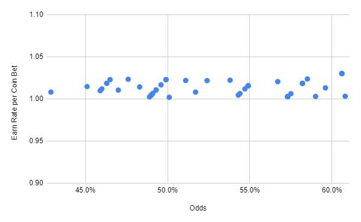

# The Economy
At the end of the last era, The Coin was melted (RIV girlboss). The many methods fans had to make coins were destroyed. Even the very concept of money was abolished. The era of expansion, consumerism, inflation, and debt was at an end. Then Blaseball returned, and we forgot all about those lessons. All hail the new economy!

## What is an economy?
An economy is usually based on goods and services being produced and traded. An individual must therefore produce something of value in order to participate in the economy. NEW Blaseball says, "Nah that's dumb. People should get free money and gamble with it. Now *that's* an economy!"

And so it is. Fans start off with **500 chips and 50 votes** when they join Blaseball and receive a UBI allowance of **100 chips and 20 votes** each day during the weeks Blaseball is played. The only use of votes in Season 1 was to stuff the ballot box in the blind hope that your team will actually win a blessing. (My team did not.) Oh or you could have tried to stop the fandom from opening the Forbidden Book and unleashing chaos, death, and destruction... but you probably knew from the start that was a fool's errand. (That didn't stop me from voting for Redistribute the Wealth, though.) Chips are a slightly more flexible currency. They can be converted to votes on the Election page, but votes cannot be converted back into chips. The only other thing to do with chips is to **gamble**!

## The Economy has one lever.
Betting is the only way for a fan to take the chips they have and turn them into a bigger number of chips. Betting on the first day is forbidden. Betting on the second day wasn't ready. But on the *third* day... we bet! Each game has a set of odds prescribed by a mysterious algorithm. Fans can stake up to 20 chips on each game, and wins earns them chips. The payout depends on the odds, though, to prevent people from simply betting on the favorite every time. The exact formula for the payout could make or break a betting economy! The first thing we at SIBR started to investigate was the fairness of the Odds vs. Payout formula.

A spreadsheet was opened. Numbers sprang forth. Calculations were spread across the page. A number of people started logging the teams they voted for, the odds assigned to that team, and the size of the payout when they won. Thanks to the efforts of a collective of researchers, we had a good dataset within 12 hours of games starting. *(Thanks to jimr on Discord for starting that!)* Calculating the Expected Value (EV) of each bet showed that EVs very slightly above 1. When plotted, the EVs look very flat across the whole range of odds! *(Thanks to Cowboy Moth on Discord for data wrangling and plotting that!)* Finally, we got a formula for determining the payout based on the odds and size of the bet: ``CEILING(Bet/Odds)`` i.e. divide your bet by the odds and round up! *(Thanks to Sinjid on Discord for determining that!)*

What does that mean? Well, it tells us that betting is hypothetically rather fair. You're not better off betting on favorites or underdogs. The fact that payouts always round up actually means that the economy should be slightly inflationary, so it would be in the average person's interest to bet a lot in order to make a modest number of chips. Overall profits shouldn't be very large, though. However, all of these statements depend on one very critical assumption: that the odds listed on the site are accurate!

## Beat the Sim!
Many people scattered to find a method of betting that would beat the sim. People would bet a certain way for a number of games and report and compare their findings. Some avenues look promising. Others were inconclusive. To make a truly convincing argument, though, big data was needed. On Wednesday of Season 1, one of the first big proofs that there was a way to beat the sim was posted by kaia#8179 on Discord. It showed that the favored teams were on the whole being underestimated! They were winning more games than the odds thought they should.

It was also around this time that the incredibly impressive archival efforts of SIBR began bearing fruit in the form of APIs and data dumps. *(Thanks Astrid!!)* I was able to collect, merge, and manipulate that data to calculate the performance of various betting methods. My goal was to see how much profit a given method would generate if you always bet 20 chips using that method for the entire season. How I did this might be the topic of a future blog post, but for now let's skip straight to the results!

## Record Profits

First, I tested some very simple strategies that only required information from the betting page itself to implement. I tried out betting only on favorites, only underdogs, and for the team with the better record. Based on kaia#8179's previous findings, it was no surprise that only betting on the underdogs would lose you a lot of chips. It was quite a sizeable profit to bet on the favorites. Much better than what a fair odds system should pay out! Betting based on record was even better, even if you didn't bet on games with only a small difference in record!

![Three tables showing profits from betting either for the Favorite at various Odds thresholds, the Underdog at various Odds thresholds, and the team with the Better Record at different win differential thresholds. The Favorites table peaks at at 3328 chips profit at >51% and decreases linearly to near 0 at 60%. The Underdog table peaks at -3591 chips profit at <49% and increases linearly to near 0 at 40%. The Record table Peaks at 5192 chips profit at >=2 win differential and decreases to 4162 at >=10 win differential.](SimpleBets.png)

It doesn't seem right to bet on some games and not others, though. So I also developed some combined methods of betting. These performed even better!

Then I looked at more complicated methods of betting. I calculated the non-rounded star ratings of each team's skills (batting, running, defense, pitching, and vibes).  To my surprise, batting stars was the best predictor of a win so far! Congrats to the Sunbeams for winning that NEW Batting Boost blessing, I guess. I also calculated the stars of the starting pitchers for each game, and to no surprise that performed a little better than the team's overall pitching.

My [Season 1 Economic Report](https://docs.google.com/spreadsheets/d/1gWt4dGGDhxZtSNDXnwXDmAB79sp4LyGhIq2L5SKEBU0/) is viewable by anyone. It can be copied and manipulated by you, dear reader. I've seen others take my data and use it to test all sorts of scenarios besides these, with some pushing even greater theoretical profits. I must warn you, though... Blaseball is unpredictable, and often it is wildly unpredictable. I would **not** say that spreadsheets like mine can predict what the best betting strategy will be next season. The mechanics of the simulation could change, new weather could blow in, and (Namerifeht forbid) we could see underhanded pitchers again. So beware! But you can be sure that next season I'll rerun the numbers and tell you what some good strategies were... in hindsight.

## Final Thoughts

Altogether, the fanbase used over 2 million votes in the Season 1 election! About of third of those votes were spent on decrees (if you're willing to believe "Facts" Machine...). The amount of votes spent per blessing ranged from ~12,500 to ~215,000. Well done, voters! *(Thanks, Edgarware, for those numbers!)* 

Hopefully you feel more informed now to go and bet next season! Beat the sim and hoard a pile of chips! It's a golden age! A Golden Record age? Don't worry about bankrupting the league; Blaseball can just print more money! Surely nothing bad will come of it.